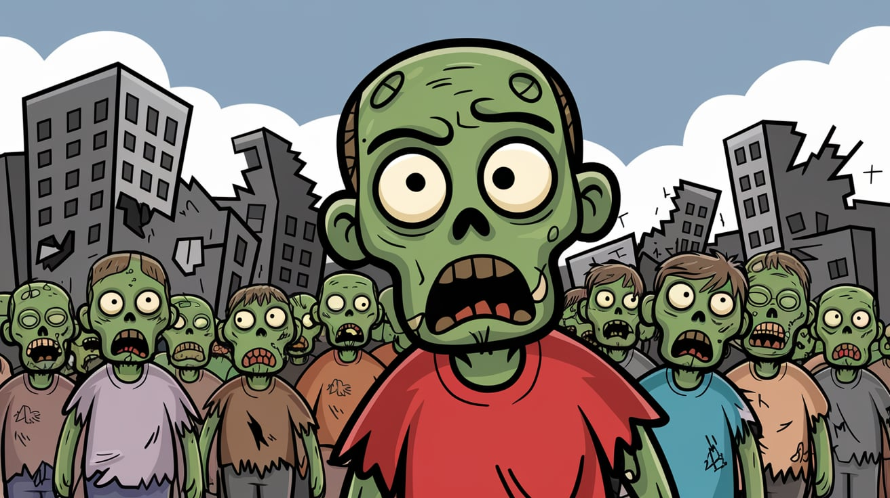

# Zombie Apocalypse Simulator

A dynamic, web-based simulation that models the interactions between humans, zombies, and specialized entities in a simulated apocalypse scenario.

## Overview

This project creates an interactive simulation of a zombie outbreak scenario. Users can adjust various parameters and watch as different entities interact according to predefined rules in a contained ecosystem.

## Features

- **Dynamic Simulation**: Real-time visualization of zombie apocalypse dynamics
- **Adjustable Parameters**: Control the initial population of each entity type
- **Entity Size Control**: Adjust the size of all entities for better visibility
- **Win/Loss Conditions**: Clear victory conditions for both humans and zombies

## Entities

| Type | Description |
|------|-------------|
| **Humans** | Regular civilians that can be infected by zombies or zombie kings |
| **Zombies** | Infected humans that can infect other humans |
| **Doctors** | Special humans who can cure zombies (but not kings) |
| **Hunters** | Combat specialists who can kill zombies and zombie kings |
| **Zombie Kings** | Powerful zombies that can infect humans and doctors; when all kings die, all zombies die too |

## Game Rules

### Interactions
- Zombies infect humans on contact
- Zombie Kings infect both humans and doctors
- Doctors cure zombies back to humans
- Hunters can kill both zombies and kings
- When all kings are eliminated, all zombies die

### Victory Conditions
- **Humans Win**: When all zombies and kings are eliminated
- **Zombies Win**: When all humans and doctors are infected

## Setup Instructions

1. Clone or download this repository
2. Ensure all image files are in the same directory:
   - zombie.png
   - human.png
   - doctor.png
   - hunter.png
   - king.png
   - Zombieapocalypse.jpeg
3. Open `index.html` in a web browser

## Controls

- Use the number inputs to set the initial count of each entity type
- Adjust the entity radius with the slider for better visibility
- Click "Start Simulation" to begin, and again to stop the simulation

## Project Structure

- `index.html` - Main HTML file containing the UI elements
- `script.js` - JavaScript file containing simulation logic
- Image files - Entity icons and banner image

## License

This project is licensed under the MIT License - see the [LICENSE](LICENSE) file for details.

## Credits

Brian (Junho) Hong/Washington University in St. Louis 